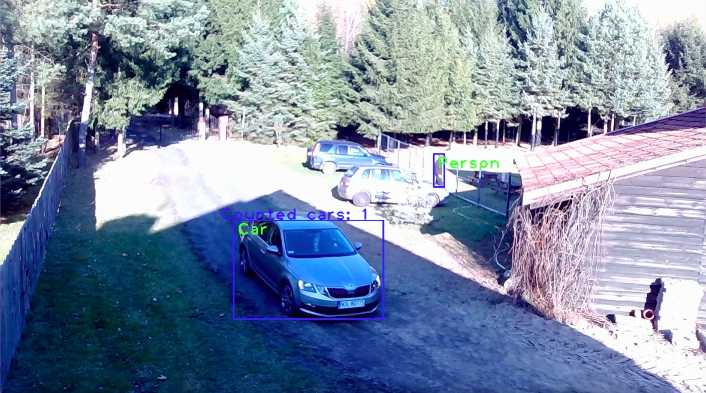

 This program was created to detect people nearby the fence (if there are people nearby, program is sending an email), and to detect and count cars passing by using cv2 and coco.
The input is a mp4 format video from a webcam. I've choosen three areas from the main frame, two of them show area nearby fence, third area shows fragment of the road. 

